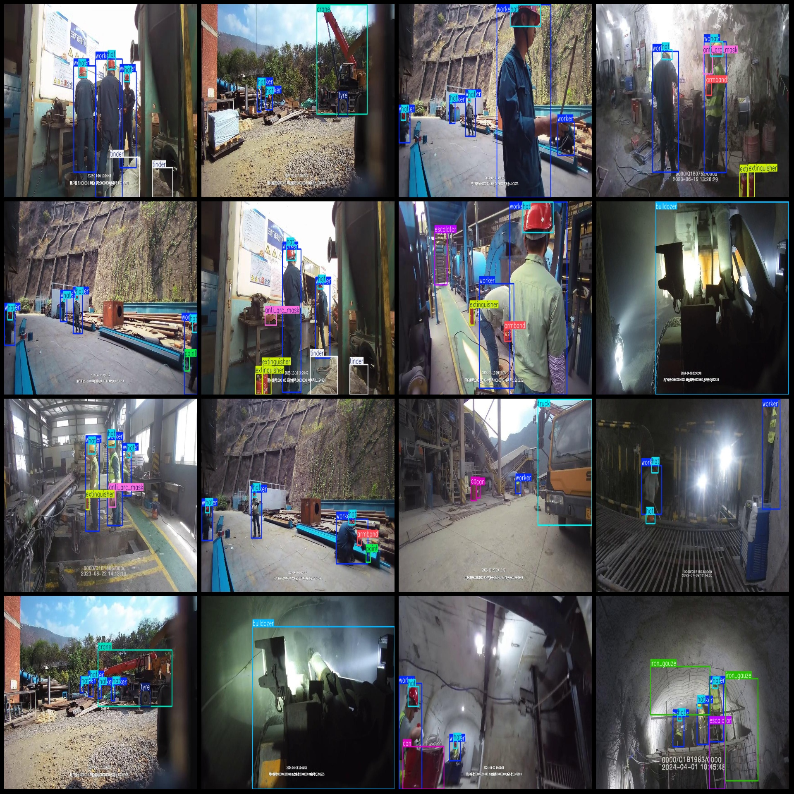
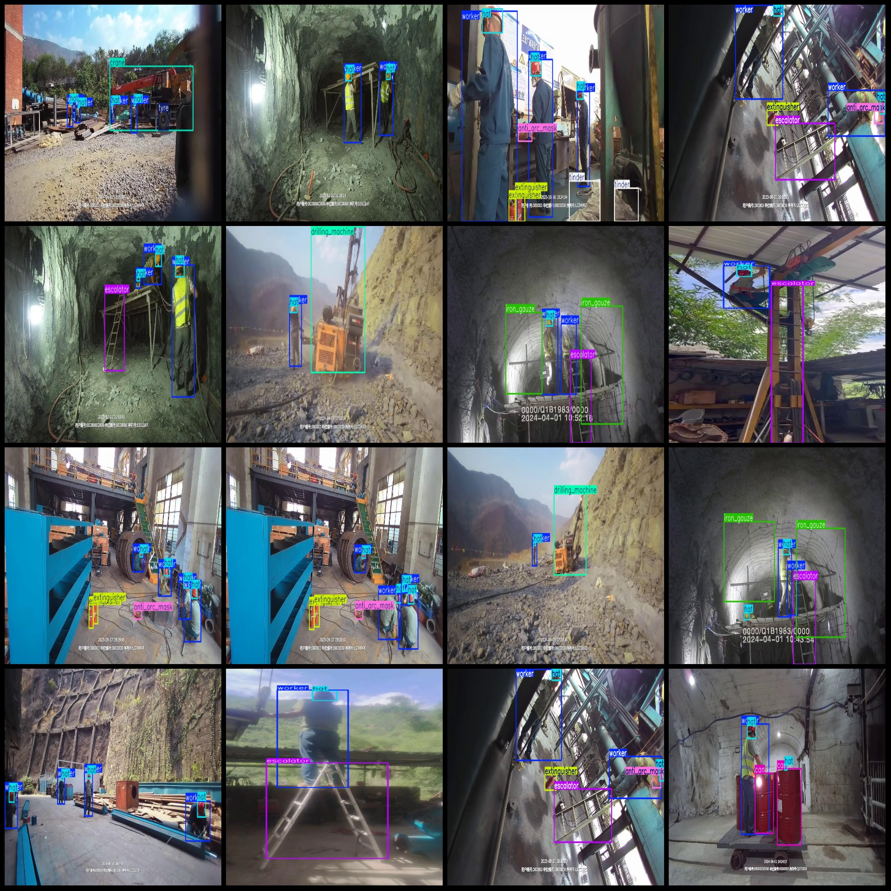

# Tunnel Construction Object Detection Dataset VOC+YOLO Format 3012 Images 19 Categories

Dataset format: Pascal VOC format + YOLO format (txt files without split paths, only containing jpg images and corresponding VOC format xml files and yolo format txt files)
Number of images (jpg file count): 3012
Number of annotations (xml file count): 3012
Number of annotations (txt file count): 3012
Number of categories: 19
Categories in labels folder (notice that the order of yolo format categories does not correspond with this, and is according to the labels folder's classes.txt): ["anti_arc_mask", "armband", "bulldozer", "can", "crane", "discharge_table", "distribution_box", "drilling_machine", "escalator", "extinguisher", "hat", "iron_gauze", "loader", "paint", "spark", "tinder", "truck", "tyre", "worker"]
Each category has a number of bounding boxes and image shares:
anti_arc_mask (Anti-Arc Mask) bounding box count = 567, shares image count = 475
armband (Armband/Cloak) bounding box count = 552, shares image count = 552
bulldozer (Backhoe) bounding box count = 237, shares image count = 237
can (Can/Tank) bounding box count = 447, shares image count = 294
crane (Crane) bounding box count = 131, shares image count = 131
discharge_table (Discharge Table/Drainage Table) bounding box count = 234, shares image count = 234
distribution_box (Distribution Box) bounding box count = 162, shares image count = 101
drilling_machine (Drilling Machine) bounding box count = 223, shares image count = 223
Escalator (Auto-Elevator) Frames = 681, Occupied Pictures = 641
Extinguisher (Fire Extinguisher) Frames = 1289, Occupied Pictures = 834
Hat (Safety Hat) Frames = 4905, Occupied Pictures = 2305
Iron Gauze (Wire Net/Wire Screen) Frames = 417, Occupied Pictures = 225
Loader (Loader) Frames = 23, Occupied Pictures = 23
Paint (Paint) Frames = 70, Occupied Pictures = 70
Spark (Spark) Frames = 208, Occupied Pictures = 208
Tinder (Flame Starter/Lightning Source) Frames = 483, Occupied Pictures = 257
Truck (Truck) Frames = 576, Occupied Pictures = 545
Tire (Tire) Frames = 306, Occupied Pictures = 211
Worker (Worker) Frames = 5575, Occupied Pictures = 2545
Total Frames: 17086
Image Resolution: Multi-resolution images such as 480x848, 854x480 etc.
Annotation Tool Used: labelImg
Annotation Rules: Rectangular boxes are drawn around the categories.
Important note: The dataset does not have a split into training, validation, and test sets. Please split it yourself.
Special Disclaimer: This dataset does not guarantee the accuracy of the trained model or the weight files.
Preview of the image:
## Image

Here is a pay link on Stripe ( https://buy.stripe.com/3cs8yP7sY87d0vu9AB ). Please contact me lonlonago@foxmail.com after funding $89, and I will send you a complete data files , thank you!

